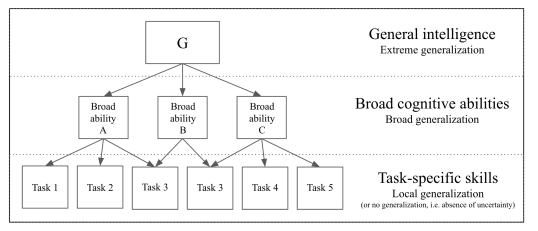
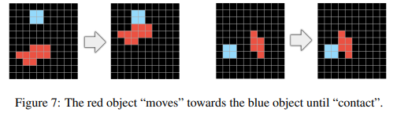
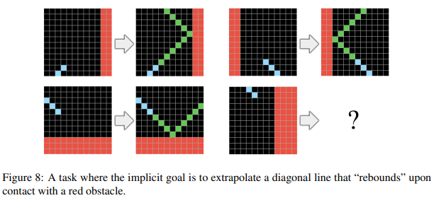
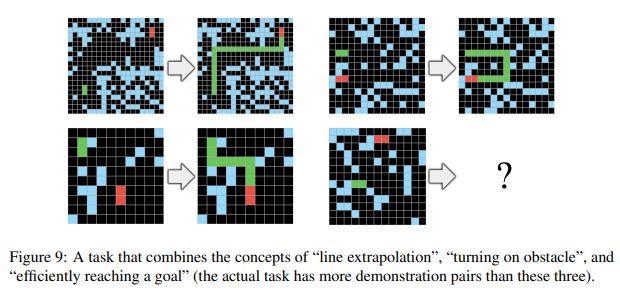
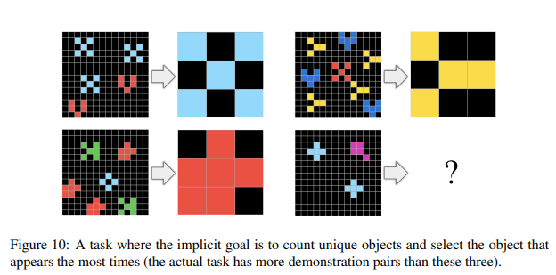
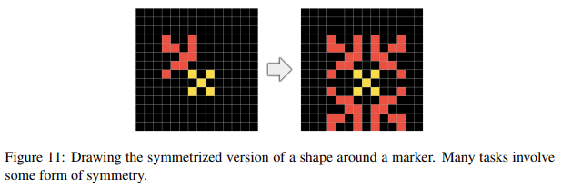

# Chapter 0: Introduction to ARC and Intelligence

**Lucas Pecina**

*AI Researcher and Head of AI at Y-TEC*

*Nov 2024*

## Introduction to the Series

My name is Lucas Pecina, and I lead AI research at Y-TEC. This series of videos will document my research on solving the **ARC-AGI** challenge. I'll share my progress, research, and insights as I delve into ARC, analyze existing solutions and approaches, and conduct my own investigations. All my code and research will be open source. I'll also explore relevant papers and new proposals in the field.

---

## History of AI: Task-Specific Approaches vs. Generalization

> "To make deliberate progress towards more intelligent and more human-like artificial systems, we need to be following an appropriate feedback signal: we need to be able to define and evaluate intelligence in a way that enables comparisons between two systems, as well as comparisons with humans."  
> —From the abstract of *"On the Measure of Intelligence"* by François Chollet

Throughout the history of AI, there have been two main schools of thought in defining its objectives. These perspectives focus on the dichotomy between **task-specific skill** and **general learning ability**.

### Intelligence as a Collection of Task-Specific Skills

This view, rooted in evolutionary psychology, suggests that human cognitive function is largely the result of **special-purpose adaptations** that evolved to solve specific problems encountered throughout human evolution. In early AI, intelligence was seen as a set of **static routines** similar to programs, heavily relying on logical operators and storing learned knowledge in database-like memory.

**Minsky's View:** Focuses on an AI's ability to perform economically valuable tasks, evaluating its intelligence based on its performance in specific tasks, such as board games or video games.

### Intelligence as a General Learning Ability

This perspective posits that intelligence lies in the **general capacity to acquire new skills through learning**. This ability could be directed toward a wide range of previously unknown problems, perhaps even any problem. Alan Turing, in his 1950 paper, proposed the idea that machines could acquire new skills through a learning process similar to that of human children.

This view echoes Locke's concept of **"Tabula Rasa"**, seeing the mind as a flexible, adaptable, and highly general process that transforms experience into behavior, knowledge, and skills.

**McCarthy's View:** Prioritizes generality—the ability of machines to handle problems for which they have not been prepared.

---

François Chollet **criticizes both perspectives** for being too simplistic. He argues that Minsky's view reduces intelligence to skill in specific tasks, ignoring the capacity for generalization. On the other hand, McCarthy's view, while recognizing the importance of generalization, does not provide a precise definition or a way to measure it.

In summary, the human mind is a complex system that **combines both innate biases and the ability to learn from experience**. These biases are not a limitation to our generalization capabilities but rather their source—the reason why humans can acquire certain categories of skills with remarkable efficiency.

---

## Characteristics for Evaluating Intelligence

To progress toward more flexible and general AI, we need to go beyond skill-based evaluation and adopt methods that capture systems' ability to handle novel and uncertain situations. The greatest successes in AI have been in building special-purpose systems capable of handling well-defined tasks, sometimes with superhuman performance. This success has been driven by performance measures that quantify a system's **skill** in a given task (e.g., how well an AI plays chess or recognizes images).

### Generalization

**Degrees of Generalization (Spectrum):**

- **No Generalization:** Systems without uncertainty, such as deterministic programs or algorithms with correctness proofs.
  
- **Local Generalization (Robustness):** Ability to handle new inputs from a known distribution for a single task, like an image classifier recognizing new images after training.
  
- **Broad Generalization (Flexibility):** Ability to handle a wide range of tasks and environments without human intervention, like a fully autonomous vehicle or a household robot passing Wozniak's coffee cup test.
  
- **Extreme Generalization:** Ability to handle entirely new tasks that share only abstract similarities with previously encountered situations, like human intelligence.

The term "**generality**" refers to human-centered extreme generalization—the capacity to generalize across the tasks and domains relevant to human experience.

This spectrum reflects the hierarchical organization of human cognitive abilities, as described by theories of intelligence structure in cognitive psychology (e.g., CHC, g-VPR).

**Skill in a specific task is not necessarily indicative of intelligence.**

The capacity for **generalization** runs orthogonal to prior knowledge and experience. A system can achieve high performance in a task due to extensive knowledge or training **without necessarily being able to generalize to new situations**.

Contemporary **deep neural networks**, despite their success, remain systems of local generalization, similar to a locality-sensitive hash table.

To evaluate intelligence meaningfully, it's crucial to **control for prior knowledge, experience, and generalization difficulty**, rather than focusing solely on task-specific skill.

Human intelligence, although broad compared to other animals, **is not universal**. Humans excel in specific cognitive tasks but struggle in other domains that might be trivial for different systems.

**"General intelligence" is not binary** but a spectrum depending on:

- **Scope of Application:** The set of tasks where intelligence applies.
  
- **Skill-Acquisition Efficiency:** How effectively a system turns prior knowledge and experience into new skills.
  
- **Generalization Difficulty:** The inherent complexity of tasks within the considered scope.

---

## Chollet's Definition of Intelligence

> "We then articulate a new formal definition of intelligence based on Algorithmic Information Theory, describing intelligence as skill-acquisition efficiency and highlighting the concepts of scope, generalization difficulty, priors, and experience, as critical pieces to be accounted for in characterizing intelligent systems."  
> —From the abstract of *"On the Measure of Intelligence"*

Chollet defines intelligence as the **efficiency in acquiring new skills over a range of tasks, considering prior knowledge, experience, and generalization difficulty**.

In other words, it's a system's ability to learn new skills with minimal information and experience.

He emphasizes that **intelligence is a process, not a product**. It's about learning and adapting, not just executing preprogrammed skills. **Skill** is the product of intelligence—the result of learning.

Three key concepts to define and measure intelligence:

- **Fluid Intelligence vs. Static Skill:** Fluid intelligence is the ability to synthesize new programs or strategies for novel problems, while static skill relies on a set of solutions for known problems.
  
- **Operational Area:** The range of situations where a system can successfully operate. A more intelligent system has a broader operational area, allowing it to generalize more widely.
  
- **Information Efficiency:** Measures how much data a system needs to acquire a new skill or program. A more intelligent system uses information more efficiently.

Chollet introduces the concept of a **Curriculum**—a sequence of interactions during training. A good curriculum can significantly improve a system's skill-acquisition efficiency.

---

## Introduction to ARC (Abstraction and Reasoning Corpus)

Chollet argues for **new ways to evaluate AI** to measure real progress toward general, less memorization-dependent intelligence. Current methods, focusing on model scaling and task-specific performance, don't adequately assess generalization.

**Limitations of Common AI Tests:**

- Allow systems to "cheat" by memorizing patterns rather than understanding.
  
- Don't evaluate the ability to generalize to new tasks not included in training.
  
- Focus on skill rather than learning capacity.

To address these, Chollet proposes **ARC**, designed to measure a form of human-like fluid intelligence.

### What is ARC?

ARC is a benchmark for general AI, program synthesis, and a psychometric test of intelligence. It's aimed at both humans and AI systems seeking to emulate human-like general fluid intelligence.

**Key Features of ARC:**

- **Novel Tasks:** Tasks are new to both the system and developers, preventing memorization and encouraging generalization.
  
- **Abstraction and Reasoning:** Requires extracting abstract patterns and applying them to new situations, evaluating reasoning ability.
  
- **Few Examples:** Provides limited examples, forcing efficient learning and generalization from minimal information.
  
- **Controlled Priors:** Based on explicit priors (innate knowledge) similar to human priors, allowing fair comparison between AI and humans.

---

### Core Knowledge Priors

**a. Object Priors:**

Based on the human ability to perceive the world as composed of individual objects.

- **Object Cohesion:** Objects hold together and move as units, defined by color continuity or spatial contiguity.
  
- **Object Persistence:** Objects remain despite noise or partial occlusion.
  
- **Influence by Contact:** Objects interact through physical contact, not at a distance.

**b. Goal-Directedness Prior:**

Reflects the human tendency to interpret actions as goal-oriented. While ARC doesn't handle time explicitly, many tasks can be seen as initial and final states of an intentional process. This prior isn't strictly necessary but can be useful.

**c. Number and Counting Priors:**

Based on the innate human ability to understand and manipulate small numbers. ARC includes tasks involving counting, ordering, comparing, and basic arithmetic with numbers less than 10.

**d. Basic Geometry and Topology Priors:**

Reflects intuitive understanding of space and shapes. ARC includes concepts like lines, rectangles, symmetries, rotations, translations, scaling, distortions, containment, and connecting points.

**Note:** ARC doesn't use language, real-world images, or common-sense knowledge acquired through experience. This ensures tasks are novel for both humans and machines, focusing on fluid intelligence—reasoning and abstraction.

> "Crucially, to the best of our knowledge, ARC does not appear to be approachable by any existing machine learning technique (including Deep Learning), due to its focus on broad generalization and few-shot learning, as well as the fact that the evaluation set only features tasks that do not appear in the training set."

---

## Limitations of Large Language Models (LLMs)

Chollet observes that current LLMs, despite impressive capabilities, have **significant limitations**:

- **Dependence on Familiarity:** Excel in tasks similar to training data but fail in novel tasks or those requiring deep reasoning. They rely on memorization and superficial pattern recognition, not true understanding.
  
- **Fragility to Changes:** Small modifications in task formulation or variables can drastically affect performance, showing a lack of robustness and deep understanding.

LLMs are essentially **databases of "skill programs"**, each representing a specific ability like translation or creative writing.

During training, LLMs learn to **map input tokens to output tokens**, building vector functions encoding these mappings. Due to memory limits, they **compress the space of memorized programs**, expressing new ones using fragments of known programs. This allows **limited generalization** to slightly different inputs.

However, this generalization is limited:

- **Caesar Ciphers:** LLMs can decrypt common key sizes but fail with unusual ones, indicating memorization of specific cases rather than understanding the cipher.
  
- **Logic Problems:** Solve familiar problems but fail when variables change, suggesting reliance on memorized patterns over logical reasoning.

These examples show that **LLMs' performance heavily depends on task familiarity**. They can handle complex tasks only if they've memorized solutions.

This limitation applies to all deep learning models—an inherent consequence of fitting models to training data.

---

## Abstraction as the Engine of Generalization

Chollet argues that **abstraction** is fundamental for generalization. It involves identifying patterns and relationships and encoding them into abstract representations reusable in new situations.

He distinguishes **two types of abstraction**:

- **Abstraction over Values:** Compares continuous values. This is what deep learning models do—effective for perception tasks but limited in abstract reasoning.
  
- **Abstraction over Programs:** Compares discrete programs (graphs) by finding exact structural matches (subgraph isomorphisms). This is analogous to human reasoning and software engineering practices. It relies on structural similarity.

He suggests that **intelligence arises from combining these two forms of abstraction**. The human brain exemplifies this, with the left hemisphere associated with reasoning (program-centric abstraction) and the right with perception (value-centric abstraction).

LLMs focus on **abstraction over values**, explaining their limitations in generalization and abstract reasoning.

**Transformers**, the architecture behind many LLMs, excel in value-centric abstraction but are inadequate for program-centric abstraction, limiting their ability to generalize to new situations and perform complex reasoning.

---

## Different Approaches in AI

### 1. Discrete Program Search

- **Concept:** Exploring a space of possible programs, evaluating each to see if it produces the correct output.
  
- **Advantages:** Effective for solving tasks like those in ARC-AGI.
  
- **Challenges:** Combinatorial explosion of possible programs makes exhaustive search unfeasible.
  
- **Opportunities:** Using deep learning to guide the search can make it more efficient.

### 2. Domain-Specific Language (DSL) Program Synthesis

- **Concept:** Creating a DSL specific to ARC-AGI tasks, defining primitives like rotation and reflection.
  
- **Advantages:** Programs are concise and human-readable; search space is reduced.
  
- **Challenges:** Designing an effective DSL that's expressive yet simple is difficult.

### 3. Deep Learning

- **Based on value-centric abstraction.**
  
- **LLMs:** Impressive in language tasks but limited in generalization and abstract reasoning.

### 4. Active Inference

- Uses pre-trained LLMs further trained with code and synthetic data similar to ARC-AGI.
  
- **Inference involves adjusting the LLM with task examples, expanding them artificially for more data points.**
  
- **This approach has led to better performance in some solutions.**

**LLMs' results on benchmarks like ARC are promising but far from human capability.** They lack true generalization and rely heavily on task familiarity.

---

## Promising Approaches: Program Search + Deep Learning

To advance toward AGI, it's proposed to **combine deep learning with program search**.

### Two Main Approaches:

1. **Incorporate Discrete Programs into Models:**

   - Use deep learning as a perception layer to break down situations into discrete elements fed into a program search engine.

2. **Use Deep Learning to Guide Program Search:**

   - Deep learning provides "intuitions" or "sketches" to guide the search, reducing combinatorial complexity.

In ARC, these ideas can **"map out" the state or program space**, turning program search into an interpolation problem and reducing computational demands.

**Interaction of Both Abstractions Allows:**

- **Guiding Search with Intuition:** Deep learning offers insights into problem structure, directing search toward promising solutions.
  
- **Generating Efficient Programs:** Search produces more efficient, generalizable programs with deep learning's guidance.

---

## Recommendations and Potential Approaches

### 1. Integrate Programs into Deep Learning Models

- **Perception with Deep Learning for Program Search:**

  - Use deep learning to process perceptual information, identifying patterns and breaking down complex situations into discrete elements.
  
  - Represent these elements symbolically for program synthesis.
  
  - Example: A neural network identifies objects and relationships in an image, translating them into symbols for program manipulation.

- **Symbolic Extensions of Deep Learning Models:**

  - Add symbolic modules to neural networks for logical operations and reasoning.
  
  - Combine sensory data processing with abstract reasoning and knowledge manipulation.

### 2. Use Deep Learning to Guide Program Search

- **Deep Learning Intuitions for Search:**

  - Train models to predict the likelihood of programs being valid solutions.
  
  - Use predictions to prioritize program exploration, reducing computational complexity.

- **Program Sketches Generated by Deep Learning:**

  - Models generate "sketches" or templates of programs.
  
  - Sketches provide a general structure, refined through program search, guiding toward meaningful solutions.

---

## Next Steps: Approaches

- **Discuss LLMs and Inference-Time Compute:**

  - Explore fine-tuning methods and others like Test-Time Training (TTT).

- **Examine Models with Better Performance:**

  - Analyze solutions like Jack Cole's 34% success rate compared to others.

- **Conceptual Ideas: System 1 and System 2:**

  - Use deep learning for intuition (System 1) and build discrete programs for reasoning (System 2).

- **Improve Visual Pattern Recognition:**

  - Enhance models' ability to recognize and interpret visual patterns.

- **Explore Neuro-Symbolic AI and Knowledge Graphs:**

  - Deep learning creates primitives for programs used in discrete program search.

---

**All code and research will be open source.**

---
## References

1. Chollet, F. (2019). *On the Measure of Intelligence*. [https://arxiv.org/pdf/1911.01547](https://arxiv.org/pdf/1911.01547)

2. ARC Prize. *ARC Prize Guide*. [https://arcprize.org/guide](https://arcprize.org/guide)

3. ARC Prize. *General Intelligence: Define it, measure it, build it*. YouTube. [https://www.youtube.com/watch?v=nL9jEy99Nh0](https://www.youtube.com/watch?v=nL9jEy99Nh0)

4. Machine Learning Street Talk. *It's Not About Scale, It's About Abstraction*. YouTube. [https://www.youtube.com/watch?v=s7_NlkBwdj8](https://www.youtube.com/watch?v=s7_NlkBwdj8)

5. ARC Prize. *ARC Prize 2024 University Tour Virtual Event*. YouTube. [https://www.youtube.com/watch?v=NDbNlPiS898](https://www.youtube.com/watch?v=NDbNlPiS898)

6. Machine Learning Street Talk. *Pattern Recognition vs True Intelligence - Francois Chollet*. YouTube. [https://www.youtube.com/watch?v=JTU8Ha4Jyfc](https://www.youtube.com/watch?v=JTU8Ha4Jyfc)
